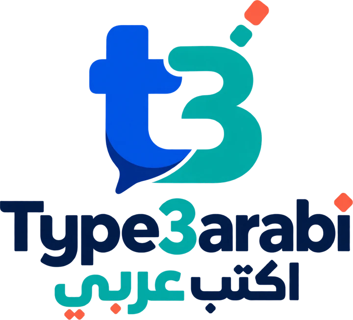
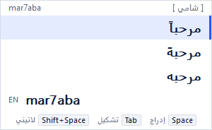
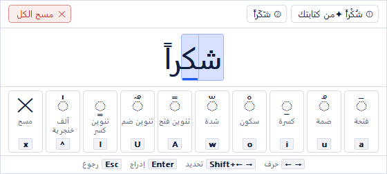
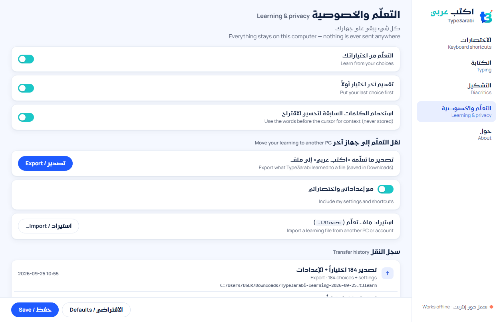

<div align="center">

<picture>
  <source media="(prefers-color-scheme: dark)" srcset="docs/assets/logo-dark.webp">
  
</picture>

### Type Arabic the way you already text.
### اكتب بالعربيزي، واقرأها بالعربية.

A native Arabic keyboard for Windows: write Arabizi (`mar7aba`, `3ala`, `2albi`) in any app,<br>
and Type3arabi turns it into the Arabic you meant, with the most likely word already picked.

[](LICENSE)
[](DATASETS.md)
[](#download)
[](https://github.com/ArabSeven/type3arabi/releases)

**[Download](#download)** · **[Try it in your browser](https://type3arabi.com/#try)** · **[Features](#features)** · **[Settings](#settings)** · **[Privacy](#privacy)** · **[Licenses](#licenses)**

</div>

<br>

<div align="center">
<picture>
  <source media="(prefers-color-scheme: dark)" srcset="docs/assets/popup-list-dark.png">
  
</picture>
&nbsp;&nbsp;
<picture>
  <source media="(prefers-color-scheme: dark)" srcset="docs/assets/tashkeel-dark.png">
  
</picture>
</div>

---

## What it is

Type3arabi (Arabic name «اكتب عربي») adds **Arabic · Type3arabi** to your Windows languages. Switch to it
with <kbd>Win</kbd>+<kbd>Space</kbd> like any keyboard, then type Arabic in Latin letters and digits the way
you already do in chats. A small list under the word shows the Arabic it could be, with the best match on top:
press <kbd>Space</kbd> and keep typing.

It works in the Windows apps you type in (Word, Chrome, Edge, WhatsApp, Teams, Outlook, Notepad…),
understands the major dialects without you picking one, and runs **100% offline**: nothing you type ever
leaves your PC.

يُضاف «اكتب عربي» إلى لغات ويندوز كلوحة مفاتيح حقيقية. اكتب بالعربيزي كما تكتب في رسائلك، في أي برنامج،
والكلمة الأنسب تظهر أولاً. يعمل دون إنترنت، مجاني ومفتوح المصدر.

## Download

**➜ [Latest release on GitHub](https://github.com/ArabSeven/type3arabi/releases)** — download
`Type3arabi-x64.msi` from the release's *Assets*. Releases are published on GitHub only.

- Windows 10 or 11, 64-bit. The installer contains both the 64-bit and 32-bit keyboard, so older 32-bit
  apps work too.
- Each release lists the SHA-256 of the installer. To check your download:
  ```powershell
  Get-FileHash .\Type3arabi-x64.msi -Algorithm SHA256
  ```

> [!WARNING]
> **The installer is not code-signed yet, so Windows will warn you.** SmartScreen shows *"Windows protected
> your PC"* / *"Unknown publisher"*. This is normal and expected for a new, independent project: code-signing
> certificates for Windows keyboards take time and paperwork to obtain, and we are working on getting one.
> Until then, choose **More info → Run anyway**, ideally after checking that the SHA-256 matches the one on
> the release page.

### Install

1. Run the installer. On the *Options* page you can keep or untick the desktop shortcut to Settings.
2. Restart when asked (recommended: apps that were already open only see a new keyboard after a restart).
3. Press <kbd>Win</kbd>+<kbd>Space</kbd> and choose **Arabic · Type3arabi**, or press
   <kbd>Ctrl</kbd>+<kbd>Alt</kbd>+<kbd>A</kbd> from any keyboard.
4. Type `mar7aba` and press <kbd>Space</kbd>. That's it.

To remove it: *Settings → Apps → Installed apps → Type3arabi → Uninstall*. The words it learned stay in
`%LOCALAPPDATA%\Type3arabi` until you erase them (Settings → Learning & privacy → Forget).

## Features

| | |
|---|---|
| **A real Windows keyboard** | One entry, *Arabic · Type3arabi*, in the Windows language list. Switch with <kbd>Win</kbd>+<kbd>Space</kbd> or your own global shortcut. Built on the Text Services Framework, like Microsoft's own input methods. |
| **Type the way you text** | `3` = ع, `7` = ح, `2` = ء, `5` = خ, `9` = ص/ق, `8` = ق/غ, `6` = ط — plus doubled letters, `sh`, `kh`, `gh`, `th`, `dh`… Nothing new to learn. |
| **Your word, already picked** | The most likely Arabic word is selected; <kbd>Space</kbd> inserts it. <kbd>↓</kbd>, the mouse wheel or a click picks another. |
| **Dialects, automatically** | Levantine, Egyptian, Gulf, Iraqi, Maghrebi and Modern Standard Arabic. There is no dialect to choose: it adapts to yours within a few words, and follows you when you switch. |
| **The small things, handled** | «اللّه» gets its shadda, «شكراً» its tanween, and `, ; ?` become ، ؛ ؟ automatically. |
| **Diacritics, letter by letter** | <kbd>Tab</kbd> opens the tashkeel editor: any mark on any letter, several letters at once, or a ready-made vowelling. <kbd>Ctrl</kbd>+<kbd>Enter</kbd> turns the vowels you typed into harakat. |
| **English stays English** | <kbd>Shift</kbd>+<kbd>Space</kbd> or <kbd>Esc</kbd> keeps a word in Latin letters, so you can mix both freely. |
| **Learns from you** | The choices you make come first next time. Stored on your PC only; move them to another PC with one file, or erase them. |
| **Change your mind** | <kbd>Backspace</kbd> right after a word reopens it with its list. |

<details>
<summary><b>All keys</b></summary>

**While typing a word (candidate list)**

| Key | Action |
|---|---|
| <kbd>Space</kbd> | Insert the highlighted word and a space |
| <kbd>Enter</kbd> | Insert the word without a space |
| <kbd>↓</kbd> <kbd>↑</kbd>, mouse wheel | Highlight another word · <kbd>PgDn</kbd> <kbd>PgUp</kbd> for more pages |
| click a row | Insert that word |
| <kbd>Tab</kbd> | Open the tashkeel editor for the highlighted word |
| <kbd>Ctrl</kbd>+<kbd>Enter</kbd> | Insert with harakat from the vowels you typed (`3allam` → عَلَّم) |
| <kbd>Shift</kbd>+<kbd>Space</kbd> | Insert the Latin word as typed, and a space |
| <kbd>Esc</kbd> | Insert exactly what you typed, in Latin letters |
| <kbd>Backspace</kbd> right after a word | Reopen it with its list |
| <kbd>Ctrl</kbd>+<kbd>Space</kbd> | Pause Arabic (type Latin) / resume |
| <kbd>Ctrl</kbd>+<kbd>Alt</kbd>+<kbd>A</kbd> | Switch to Type3arabi from any keyboard (global) |

**In the tashkeel editor**

| Key | Action |
|---|---|
| <kbd>←</kbd> <kbd>→</kbd> · <kbd>Shift</kbd>+<kbd>←</kbd> <kbd>→</kbd> · click, <kbd>Ctrl</kbd>/<kbd>Shift</kbd>+click | Move between letters · select several |
| <kbd>a</kbd> <kbd>u</kbd> <kbd>i</kbd> <kbd>o</kbd> | Fatha · damma · kasra · sukun |
| <kbd>w</kbd> · <kbd>A</kbd> <kbd>U</kbd> <kbd>I</kbd> · <kbd>^</kbd> | Shadda · tanween (fath, damm, kasr) · dagger alif |
| <kbd>x</kbd> · «مسح الكل» | Clear the letter's marks · clear all |
| <kbd>1</kbd>–<kbd>8</kbd>, <kbd>↑</kbd> <kbd>↓</kbd>, <kbd>Shift</kbd>+<kbd>Tab</kbd> | Ready-made vowellings (the one marked ✦ comes from how you typed the word) |
| <kbd>Enter</kbd> · <kbd>Space</kbd> | Insert the vowelled word (· with a space) |
| <kbd>Esc</kbd> or <kbd>Tab</kbd> | Back to the list |

The shortcuts in the first table can be changed in Settings.
</details>

## Settings

Open **Type3arabi Settings** from the Start menu (or the desktop shortcut). Every change applies from the next
word, in every app — no restart.

<div align="center">
<picture>
  <source media="(prefers-color-scheme: dark)" srcset="docs/assets/settings-dark.png">
  
</picture>
</div>

| Page | What you can change |
|---|---|
| **Keyboard shortcuts** · الاختصارات | Keep Latin, open the tashkeel editor, insert with harakat, the Arabic ⇄ Latin toggle and the global switch-to-Type3arabi shortcut. Click a field and press the new keys. |
| **Typing** · الكتابة | Arabic or Latin preview in the text, suggestions per page, word completions, joining «ال» with the next word, Backspace re-edit, Arabic punctuation, Western or Eastern digits, dialect (automatic by default) and the dialect badge. |
| **Diacritics** · التشكيل | How the name of Allah is written (اللّه · اللَّه · اللّٰه · الله), automatic tanween, hamza spelling, and how much harakat <kbd>Ctrl</kbd>+<kbd>Enter</kbd> adds. |
| **Learning & privacy** · التعلّم والخصوصية | Learning on/off, "last choice first", context from the words before the cursor (never stored), **export / import** what it learned (`.t3learn`, optionally with your settings) with a dated history, and **Forget everything**. |
| **About** · حول | Version, file locations, licenses. |

## Privacy

- **Offline.** The keyboard has no network code at all. No account, no cloud, no telemetry, no crash upload.
- **What it learns stays on your PC** (`%LOCALAPPDATA%\Type3arabi`): which Arabic word you chose for which
  Latin spelling. Not your sentences, not your documents. Export it, import it or erase it in Settings.
- **Password fields are left alone**: Windows turns input methods off there, and Type3arabi respects it.
- **Open source**, so anyone can check all of the above.

## How it works

Type3arabi is a Text Services Framework input processor written in Rust. For every key you type, the engine
searches a 600,000-word Arabic lexicon with a model of how people write Arabic in Latin letters, weighs each
candidate by how common it is in your (automatically detected) dialect and by what you chose before, and adds
an out-of-dictionary spelling path for names and new words. Everything runs inside the app you are typing in,
typically in well under a millisecond per key, from one read-only data file shared by all apps.

The model is learned from public datasets of Arabic text and Arabizi–Arabic pairs, listed with their authors
and licenses in [`DATASETS.md`](DATASETS.md). Details: [`docs/03-engine-algorithm.md`](docs/03-engine-algorithm.md)
and [`docs/04-data-pipeline.md`](docs/04-data-pipeline.md).

## Building from source

<details>
<summary><b>Requirements and commands</b></summary>

Rust (the version pinned in `rust-toolchain.toml`), Visual Studio 2022 Build Tools with the Windows 11 SDK,
WiX Toolset 5 for the installer, and `uv` for the data pipeline. See [`docs/07-build-release.md`](docs/07-build-release.md).

```powershell
cargo test --workspace                                   # tests (the engine also builds on Linux)
cargo run -p t3a-cli -- repl --dialect LEV               # type Arabizi, see the ranked candidates
cargo run --release -p t3a-tip --example tsf_harness     # the keyboard in a real TSF host, no install
powershell -ExecutionPolicy Bypass -File .\scripts\dev-install.ps1   # install a dev build on this PC
powershell -ExecutionPolicy Bypass -File .\scripts\build-installer.ps1 -Data target\type3arabi-release.dat
```

The language model is not stored in the repository: `tools/pipeline` downloads the datasets from their
publishers and `t3a-cli build-data` compiles them ([`docs/04-data-pipeline.md`](docs/04-data-pipeline.md)).

| | |
|---|---|
| Rules for contributors (and coding agents) | [`AGENTS.md`](AGENTS.md) |
| Where the project stands | [`STATUS.md`](STATUS.md) |
| Architecture · engine · UX | [`docs/01`](docs/01-architecture.md) · [`docs/03`](docs/03-engine-algorithm.md) · [`docs/05`](docs/05-ux-spec.md) |
| Testing a build on your PC | [`TESTING.md`](TESTING.md) |

</details>

## Licenses

| | License | Details |
|---|---|---|
| **Software** — keyboard, engine, Settings, installer, tools | [Apache License 2.0](LICENSE) | © 2026 Hassan Obaida |
| **Language model** — `type3arabi.dat`, shipped in the releases | [CC BY-NC-SA 4.0](https://creativecommons.org/licenses/by-nc-sa/4.0/) | Built from the datasets in [`DATASETS.md`](DATASETS.md); attributions in [`NOTICE.md`](NOTICE.md) |

The full statement of who owns what and which license covers it is in [`COPYRIGHT.md`](COPYRIGHT.md).
The model is non-commercial because some of the datasets it learns from are. The code is fully open (Apache-2.0).
The name, «اكتب عربي» and the logo identify this project and are not covered by either license. Fonts: Kufam and
Manrope (SIL OFL 1.1). Compiled dependencies: `THIRD-PARTY-LICENSES.html`, installed with the app.

## Support

Type3arabi is free, and nothing is locked behind payment. If it helps you and you are able to, a coffee means a lot:

<a href="https://buymeacoffee.com/hassanobaida"></a>

Found a bug or a word it gets wrong? [Open an issue](https://github.com/ArabSeven/type3arabi/issues) — the
Arabizi you typed and the Arabic you expected are all we need.

<div align="center">
<br>
Made by <a href="https://linktr.ee/hassanobaida">Hassan Obaida</a> · <a href="https://type3arabi.com">type3arabi.com</a>
</div>
